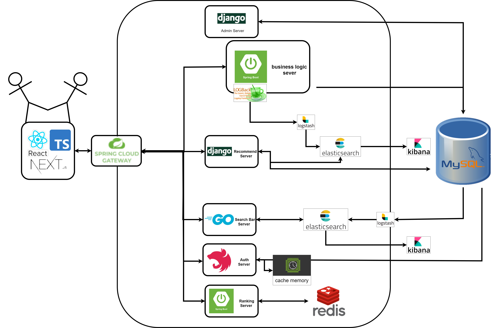
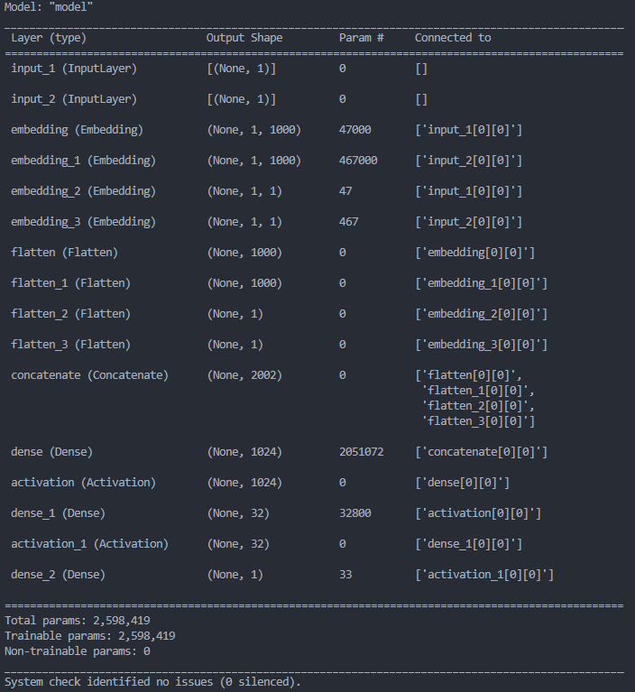

# 라면 추천 시스템

## Notion

### 특화프로젝트

- 01: https://faceted-clover-f7a.notion.site/81169fccaa85421a80e69ac9dbadcb27
- 02: https://linen-jump-272.notion.site/e96ee3e33029457cb33d390388456191

## Backend

### URL

- 비즈니스 로직 서버
  - http://j6c104.p.ssafy.io:8080/swagger-ui/index.html
- 인증 서버
  - http://j6c104.p.ssafy.io:8083/api/
- 검색 서버 Kibana
  - http://j6c104.p.ssafy.io:5602
- 사용자 로그 Kibana
  * http://j6c104.p.ssafy.io:5601

### 아키텍처 설계도

### 추천 시스템

1. 하이브리드 추천 알고리즘

   - 사용자 기반 협업 필터링 + 취향 기반 추천 알고리즘 + 사용자 실시간 로그 데이터
   - 아이템 기반 협업 필터링 + 취향 기반 추천 알고리즘 + 사용자 실시간 로그 데이터

2. 딥러닝 기반 추천 알고리즘

   - 사용자 라면 좋아요 데이터를 학습하여 라면 추천

     

## Frontend

