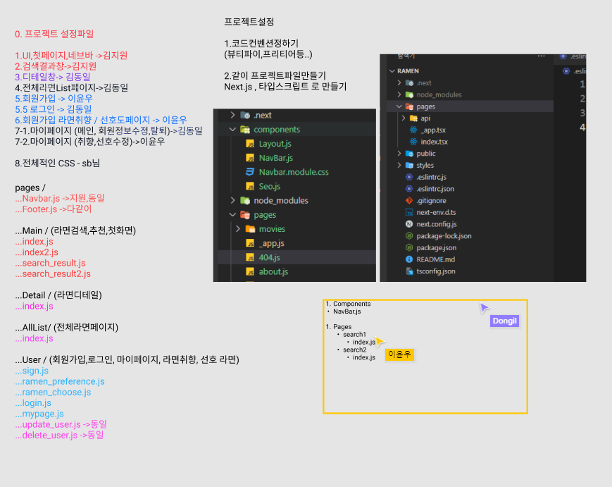

# Next.js 프로젝트생성


```
npx create-next-app@latest --typescript

앱이름 ramen
```

https://sheldhe93.tistory.com/42

https://www.kenrhee.com/blog/eslint-and-prettier-for-nextjs


tsconfig,eslint 위에 두곳 참고해서 설정완료


---

# Next.js 코드컨벤션



컴포넌트 - 첫글자 대문자

페이지 - 폴더 + 소문자


---

# 깃 컨벤션

